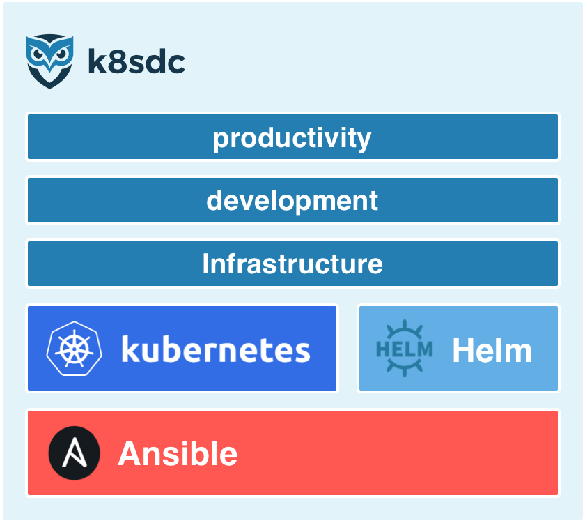

# Introduction
___

**k8sdc**, aka Kubernetes Datacenter, provides a set of curated open source productivity, development and infrastructure [*Products*](reference/product.md).  These *Products* are integrated and secured *"out of the box"* with management provided by [Kubernetes](http://kubernetes.io), [Helm](https://helm.sh) and [Ansible](http://kubernetes.io).

___

## Purpose

**k8sdc** attempts to provide an entire set of integrated IT [*Capabilities*](reference/capability.md) that can be stood up rapidly and with little to no cost (dependant on where **k8sdc** is hosted).  The provided *Capabilities* can be categorised into the following areas.

* Management of a business with productivity [*Products*](reference/product.md).
* Development and hosting of digital content with development and infrastructure *Products*.

The intention is to give small / medium and non-profit organisations the ability to easily stand up an infrastructure that rivals the *Capabilities* of an enterprise, thus freeing them to focus their resources on providing business value.

___

## Overview

**k8sdc** has [*Capabilities*](reference/capability.md) that are realised through [*Solutions*](reference/solution.md).  These *Solutions* are implemented by [*Products*](reference/product.md) with a relevant configuration.  Each *Capability* can potentially have multiple *Solutions*, leaving the choice of which to use up to the end user.

The **k8sdc** platform has a number of [*Providers*](providers/README.md) that allow it to be deployed to various cloud providers or on bare metal.

___

## Topology

Details about the **k8sdc** topology can be found [here](k8sdc/topology.md).

___

## Installation

Details about how to install **k8sdc** can be found [here](k8sdc/install.md).

___

## Roadmap

Details of the **k8sdc** roadmap can be found [here](k8sdc/roadmap.md).

